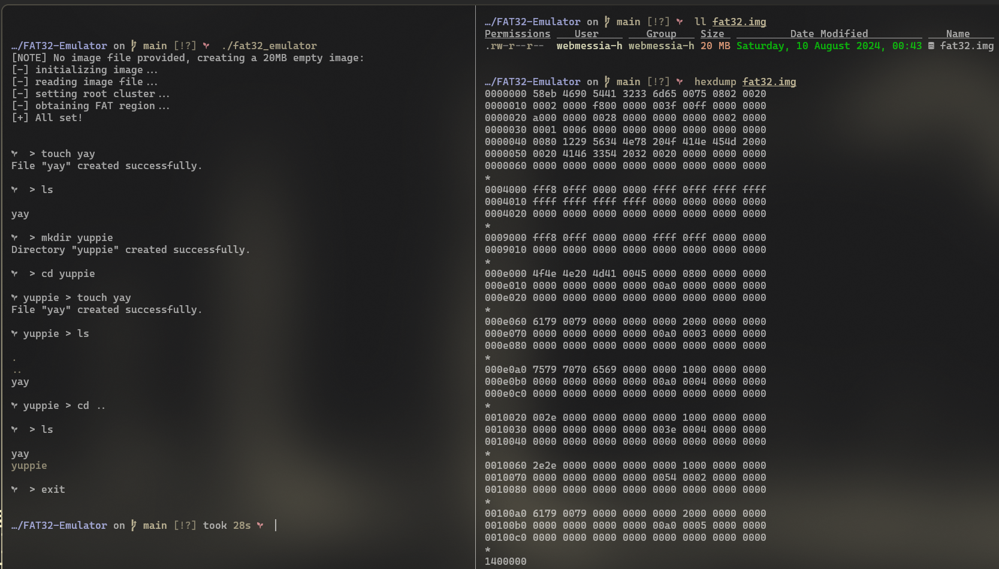

# FAT-32 Emulator

This project is a FAT-32 emulator program that allows users to manage a FAT-32 file system backed up by a file. The emulator offers a Command Line Interface (CLI) with basic commands to navigate and manipulate the file system, similar to working with a real disk.

## Features

### File Management

- **Backed by a File:** The FAT-32 file system is stored in a regular file, specified as a command line argument.
- **Automatic File Creation:** If the specified file does not exist, the emulator will create a new valid 20 MB image.

### Command Line Interface (CLI)

- **Interactive CLI:** The emulator provides an interactive CLI where you can enter commands like `cd`, `format`, `ls`, `mkdir`, and `touch`.
- **Prompt Display:** The prompt shows the current directory path, e.g., `/path>`.

### CLI Commands

- **`cd <path>`:** Changes the current directory to the specified directory. Only absolute paths are allowed. An error is displayed if the path does not exist.
- **`format`:** Formats the file to create a FAT-32 file system. This operation will erase all existing data in the file.
- **`ls <path>`:** Lists the contents of the specified directory, or the current directory if no path is provided.
- **`mkdir <name>`:** Creates a new directory with the specified name in the current directory.
- **`touch <name>`:** Creates an empty file with the specified name in the current directory.

### Error Handling

- If the backed file does not contain a valid FAT-32 file system, all commands (except for `format`) will display an error message upon failure.

## Running the Application

1. **Compile the Program:**

```sh
make
```

2. **Run with FAT-32 image-file argument or without**

```sh
./fat32_emulator <path/to/image/file>
```

## Example Usage

```sh
./fat32_emulator /home/user/test.disk
/> ls
Unknown disk format
/> format
Ok
/> ls
. ..
/> mkdir ttt
O
/> ls
. .. ttt
/> cd /ttt
/ttt> ls
. ..
/ttt> cd /
```

## Tests:

**Running without file argument:**


**Running with invalid file argument:**


# LICENSE

## This project is licensed under GNU General Public License version 3
